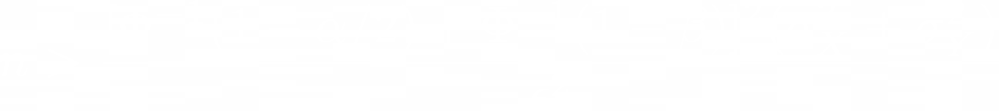
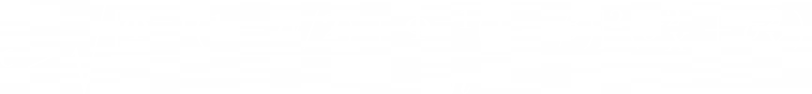

# Lesson 2: Hypothesis testing

## [Problem 3](problem_03.ipynb): PARLA

### Problem
- Estimate the minimal required group size for an experiment:
  - Experiment includes customers who made a purchase during the experiment period.
  - Experiment period is the week of February 21 to February 28.
  - Data sample should include events from the half-open interval \[datetime(2022, 2, 21), datetime(2022, 2, 28))
  - Use the data from the file `2022-04-01T12_df_sales.csv` to solve the task.
  - Experiment parameters:
    - Metric — average revenue per user (ARPU) during the experiment
    - Duration — one week
    - Significance level — 0.05
    - Acceptable probability of Type II error — 0.1
    - Expected effect — 20 rubles
  - As your answer, enter the required group size, rounded to the nearest ten (round(x, -1)).
  - Use formula:

- For the same experiment:
  - Generate control and experimental groups
  - Estimate Minimal Detectable Effect (MDE), by using the generated groups and the following formula:

### Action
- To estimate the required group size for the experiment, I:
  - Specified experiment parameters
  - Loaded, converted, filtered, grouped, and aggregated sales data
  - Calculated variance of the sales data
  - Estimated sample size using the formula for t-test above
- To estimate MDE for the experiment, I:
  - Generated the control group (by randomly sampling the sales dataframe)
  - Generated the experimental group (by subtracting control group from the sales dataframe)
  - Estimated MDE using the formula for t-test above

### Result
- The minimal required group size is correctly estimated
- MDE is also correctly estimated

### Learning
- I revised relevant Python and Pandas functionality
- I learned and applied the formula for estimating the sample size for a t-test
- I learned and applied the formula for estimating MDE for a t-test
- I learned that both minimal sample size and MDE are connected by the same formula and both can be deduced from it

### Application
- I can apply relevant Python and Pandas functionality for similar data-related problems
- I can estimate the necessary sample size for a t-test
- I can estimate MDE for a t-test

## [Problem 5](problem_05.ipynb): PARLA

## Problem
- Write a function to estimate the required minimal sample size to test the hypothesis of equal means
  - For more info see function's docstring below
  - To calculate minimal sample size use formula:

## Action
- To calculate the minimal sample size I:
  - calculated z-scores using alpha and beta
  - calculated effect size
  - calculated minimal sample size using the formula
  - calculated the average number of observations per user
  - adjusted the minimal sample size by dividing by the average number of observations per user

## Result
- The function is implemented and successfully passed all tests

## Learning
- I revised relevant Python and Pandas functionality
- I learned and applied the formula for estimating the sample size for a t-test
- I learned that it is possible to adjust the minimal sample size by dividing it by the average number of observations per user

## Application
- I can apply relevant Python and Pandas functionality for similar data-related problems
- I can estimate the minimal sample size for a t-test
- I can adjust the minimal sample size, using the average number of observations per user
